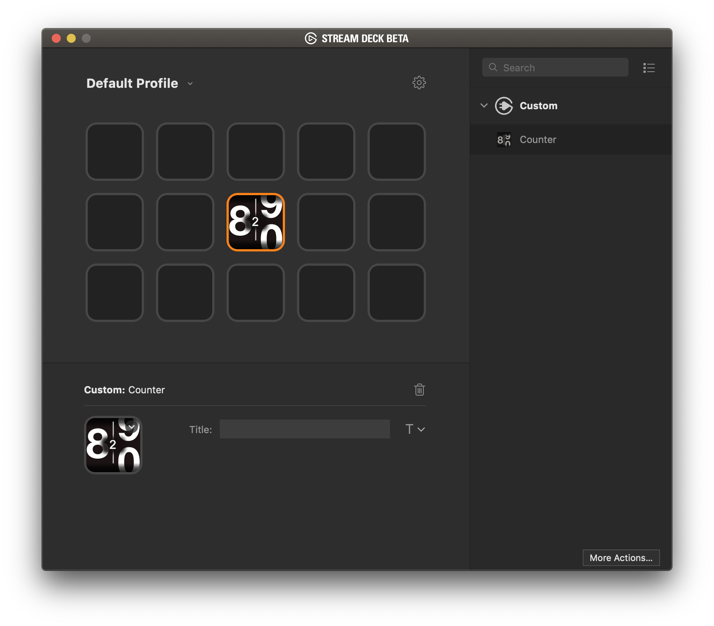

`Counter` is a sample plugin demonstrating the [Stream Deck SDK](https://developer.elgato.com/documentation/stream-deck/).

Debe activarse desde la app, en la configuracion del bridge la opcion de desarrollo
tiene que estar conectado en la misma red para que detecte quien

# Description

`Counter` is a simple plugin that displays the number of times a key is pressed. Pressing the key will increase the counter.

# Features

- code written in Javascript
- cross-platform (macOS, Windows)
- persistent settings (number of times the key was pressed)
- localized

# Installation

In the Release folder, you can find the file `com.elgato.counter.streamDeckPlugin`. If you double-click this file on your machine, Stream Deck will install the plugin.

# Source code

The Sources folder contains the source code of the plugin.
